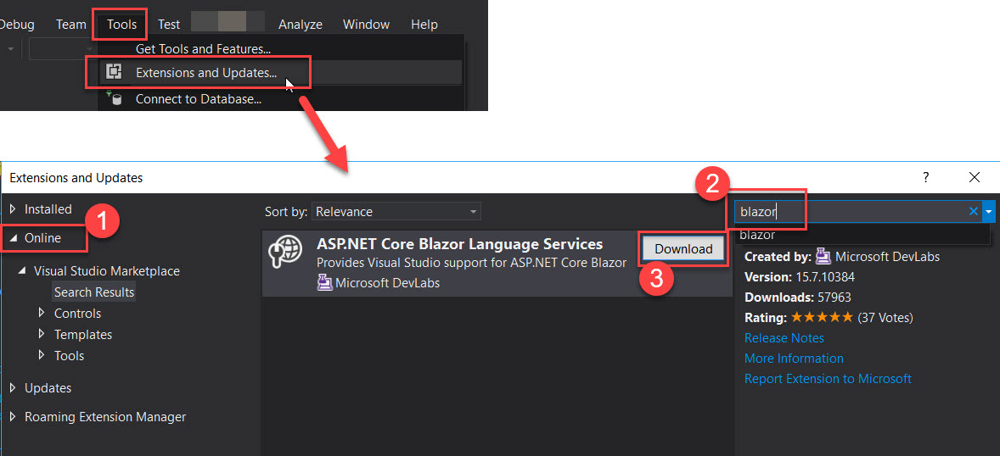

# ms-BlazorDemo

### Test MS-Blazor WebAssembly Project

Ref Url:
[http://blogs.uuu.com.tw/Articles/post/2018/07/11/%E5%88%9D%E6%8E%A2Blazor.aspx](http://blogs.uuu.com.tw/Articles/post/2018/07/11/%E5%88%9D%E6%8E%A2Blazor.aspx)

install "ASP.NET Core Blazor Language Services"

Runtime errors:
[https://stackoverflow.com/questions/50433083/npm-cannot-find-sdk-version-from-global-json](https://stackoverflow.com/questions/50433083/npm-cannot-find-sdk-version-from-global-json)

high-light:
"you actually don’t need to use a `global.json` at all: Just delete the file from your project"
